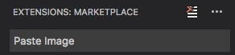
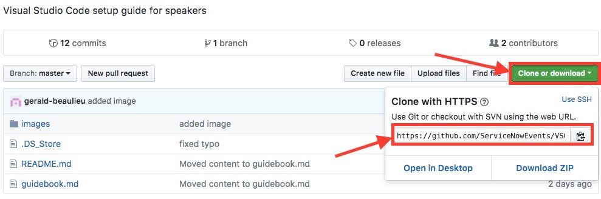
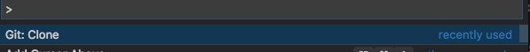
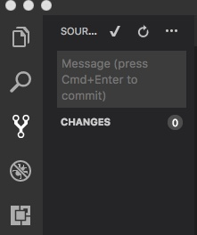
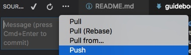

# Visual Studio Code and GitHub - Setup Guide

Visual Studio Code and GitHub setup guide for K18 Lab and CC Workshop speakers.

## Overview

K18 Marks a big change in how we deploy lab guides to our attendees as we move from a printed word document to an electronic and online guide, powered by the MarkDown syntax.

The objectives of this guide are to help our speakers properly configure the Visual Studio and GitHub tools that are required to create and publish guides.

Please pay special attention to the notes and tips provided.

Topics Covered in this Guide:

* GitHub Configuration
* Visual Studio Code Configuration
* Org and Guide Template Access
* Cloning Guide Locally
* Save and Upload Changes

# GitHub Configuration

## Create and Share Account

Follow these steps to create and share your GitHub account:

1. If you don't have a GitHub account already, navigate to [https://github.com/join](https://github.com/join) to create an account. The email address you submit should be your ServiceNow email address. The user name can be whatever you wish.
1. Send the user name defined in step 1 and the Session ID + Title to [Jason McKee](mailto:jason.mckee@servicenow.com). Jason will submit your name to the GitHub org created for K18. An invitation will be sent to your email that you must accept.

## Local Configuration

The following steps and terminal window commands need to be run on each machine to ensure GitHub is configured correctly to run with VS Studio and to properly access the GitHub repository. 

1. Load a terminal session from your computer
1. From the prompt type: Git

    * On a Mac, this may or may not initiate an installation process. If it does, follow the prompts to install. If it doesn't, then it should return a set of potential commands accessible to GIT.
1. Set your user name with this command. Replace "Mona Lisa" with your name 
* git config --global user.name "Mona Lisa"
1. Set your email address with this command. 
* git config --global user.email "email@example.com"

# VS Code Configuration

## Install Visual Studio Code - Employees

Visual Studio Code will be used as the front-end editor for the guide. A template will be provided to you as a framework and will be discussed later in this guide. Follow these steps to install Visual Studio Code

1. Load Self Service from your computer
1. Select Featured from the categories
1. Run the "Grant Temporary Admin Rights" option. This will ensure the application can be installed on your computer.
1. Select Applications from the Categories list
1. Install the option named Visual Studio Code

## Install & Configure VS Code - Non-employees

If you aren't an employee, you'll need to install VS Code and the PasteImage plugin.

1. Download and run the VS Code installer from [https://code.visualstudio.com/](https://code.visualstudio.com/)
1. Open VS Code and click the Extensions icon 
1. Search for `Paste Image`

    
1. Click 

# Org and Guide Template Access

## Submit User Name

As a K18 Lab or CC Workshop speaker, you will require access to the GitHub org set up as the repository for our guides. In addition, you will also need permission to download the guide template you are assigned to. Follow these steps to gain access to the org. 

1. If you haven't already, send your registered GitHub user name to [Jason McKee](mailto:jason.mckee@servicenow.com). Jason will submit your name to the GitHub org created for K18. An invitation will be sent to your email that you must accept.
1. Open the invitation email from "GitHub" or "jasontmckeesn" to join the ServiceNow Events organization. 
1. Click the "Join ServiceNowEvents" button
1. Repeat these steps for each GitHub invitation you receive. The second invitation should grant you access to your guide repository.

# Cloning Guide Locally

## Downloading Guide Template

Now that you have access to the org and repository by accepting the invitation, it's time to start working on your guide. But first, you need to download the guide from the repository to your local computer. Follow these steps to download. This step is only required once. 

1. Log into your GitHub account. 
1. Under the "Your Repositories" tile on the left, click the lab guide repository for your specific lab. This will open a new window with the files associated with this lab. 
1. Once loaded, click the green "Clone or Download" button. 
1. From the small dialog that opens, copy\paste the URL. (Note: You can also click the clipboard icon in the dialog)
  
1. Switch back to VS Studio Code
1. Select the "View|Command Palette" menu option
1. From the sub menu that opens, select "Git:Clone"

     

1. Paste in the URL into the dialog and press enter
1. Type in a local directory path to store the file and press Enter. A sub folder is recommended.
1. Select "Open Repository"
1. It may prompt you for an ID and Password. Plug in your GitHub ID and Password. 

# Save and Upload Changes

## Save Changes

Like any document, it's important to save your changes regularly. To do this follow these steps. 

* From the File Menu select "Save". That's it! 

## Upload Changes to GitHub

Saving the file from the menu only saves it locally. You also need to push it up to the GitHub site, but it's not necessary to do this every time. Just remember to upload after a major change to the doc and final changes of course. Follow these steps to properly upload your guide back to GitHub

1. Select the icon in the left that looks like a "Y". This is your source control access. 

    

1. Type in a short description of the recent changes made. For example: "Added new lab 3 to guide". Press the checkmark. (Note: You must do this every time you want to upload.)
1. It may prompt you with a dialog to "Stage" your changes. Press "Yes"
1. Select the "..." more option to the right of the checkmark. 
1. Select "Push". An indicator should load that it is uploading. 

     
1. To verify success, switch over to GitHub an load up the guide repository. Ensure that your changes are there.

For additional setup assistance, please look at the [wiki](https://github.com/ServiceNowEvents/VSCode-Setup-Guide/wiki) for the [Troubleshooting FAQ](https://github.com/ServiceNowEvents/VSCode-Setup-Guide/wiki/Troubleshooting-FAQ).

Markdown/GitHub Office hours are held Fridays:

* 8:30 AM EST / 1330 GMT for 30 minutes 

     Intended for EMEA and eastern points

* noon EST / 1700 GMT for one hour

    Intended for the Americas. 
    
Join the webex [https://servicenow-cmr.webex.com/meet/Dave.Slusher](https://servicenow-cmr.webex.com/meet/Dave.Slusher)